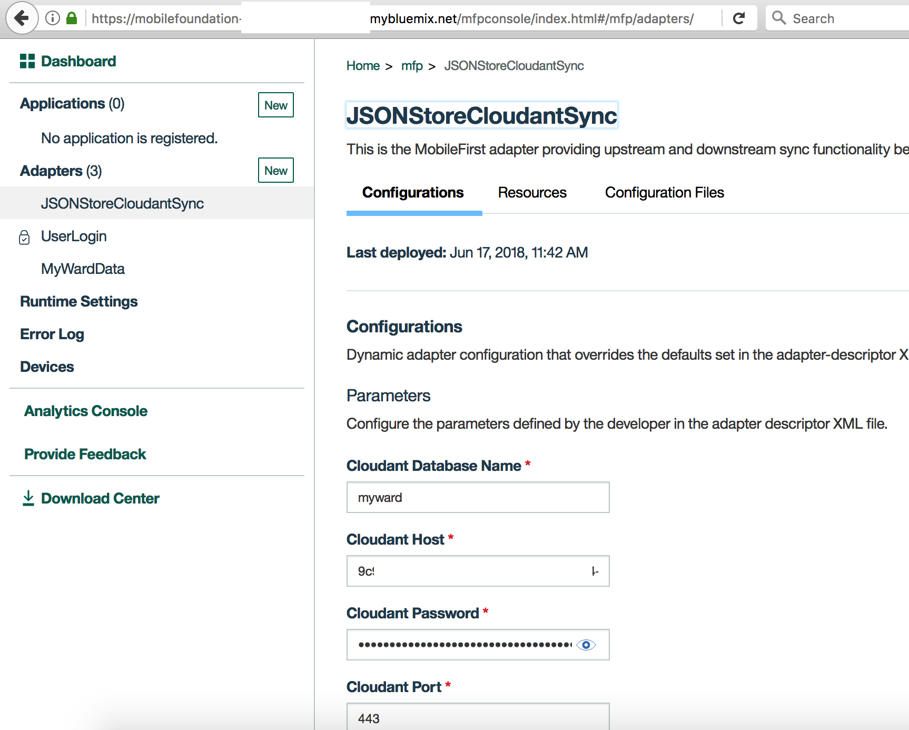
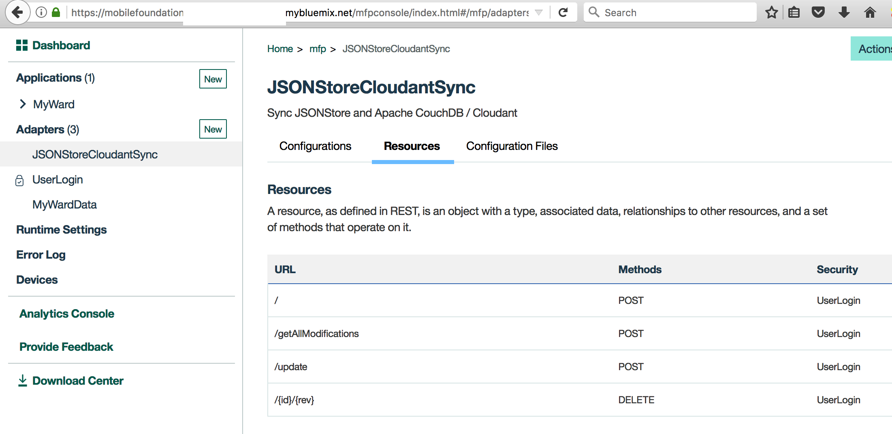
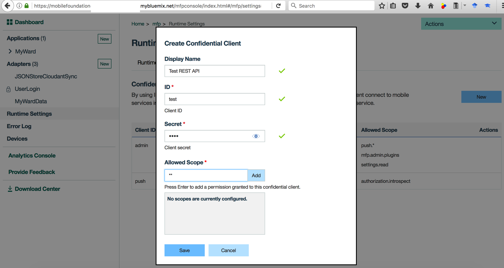
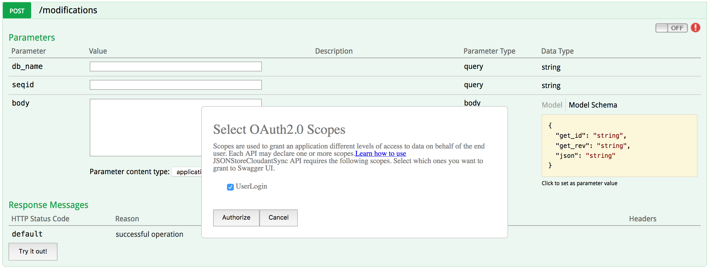
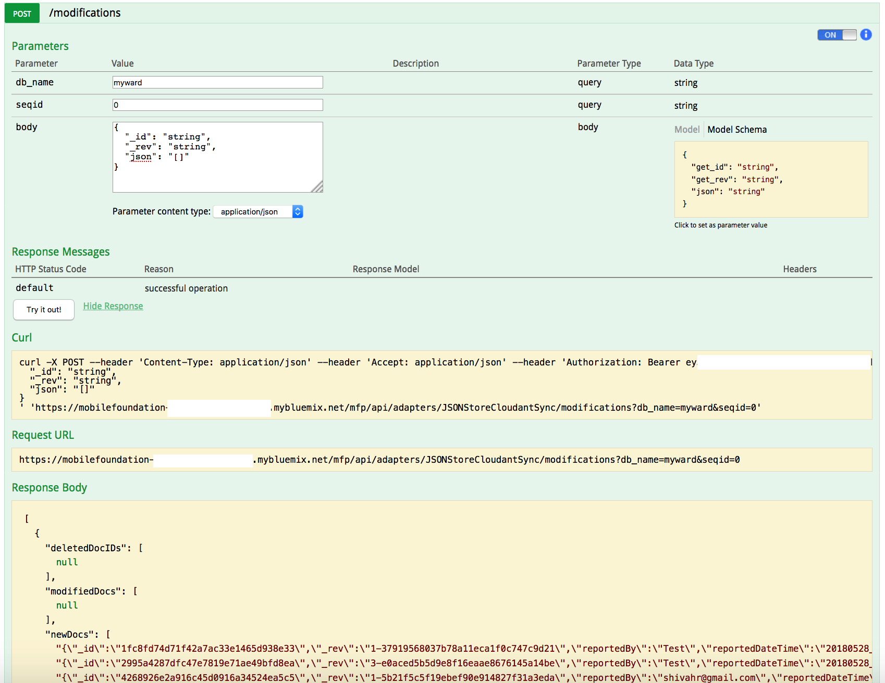

# - Work in progress -

# MFP-JSONStore-OfflineSync

# Steps

## Prerequisite steps
This project builds on top of https://github.com/IBM/Ionic-MFP-App. Run following steps from that [base project](https://github.com/IBM/Ionic-MFP-App) to provision the needed mobile backend services from IBM Cloud and populate them with sample data, as well as to setup Ionic and MFP CLI on your development machine.
 - [Step 1. Setup Ionic and MFP CLI](https://github.com/IBM/Ionic-MFP-App#step-1-setup-ionic-and-mfp-cli)
 - [Step 2. Create Cloudant database and populate it with sample data](https://github.com/IBM/Ionic-MFP-App#step-2-create-cloudant-database-and-populate-it-with-sample-data)
 - [Step 3. Create IBM Cloud Object Storage service and populate it with sample data](https://github.com/IBM/Ionic-MFP-App#step-3-create-ibm-cloud-object-storage-service-and-populate-it-with-sample-data)
 - [Step 4. Create Mobile Foundation service and configure MFP CLI](https://github.com/IBM/Ionic-MFP-App#step-4-create-mobile-foundation-service-and-configure-mfp-cli)

## Step 5. Download source repo and customize

### 5.1 Clone repo

```
$ git clone https://github.com/IBM/MFP-JSONStore-OfflineSync.git
$ cd MFP-JSONStore-OfflineSync
```

### 5.2 Update App ID, Name and Description

Update `IonicMobileApp/config.xml` as below. Change `id`, `name`, `description` and `author` details appropriately.

<pre><code>
&lt;?xml version='1.0' encoding='utf-8'?&gt;
&lt;widget <b>id="org.mycity.myward"</b> version="2.0.0" xmlns="http://www.w3.org/ns/widgets" xmlns:cdv="http://cordova.apache.org/ns/1.0" xmlns:mfp="http://www.ibm.com/mobilefirst/cordova-plugin-mfp"&gt;
    <b>&lt;name&gt;MyWard&lt;/name&gt;
    &lt;description&gt;Get your civic issues resolved by posting through this app.&lt;/description&gt;
    &lt;author email="shivahr@gmail.com" href="https://developer.ibm.com/code/author/shivahr/"&gt;Shiva Kumar H R&lt;/author&gt;</b>
...
</code></pre>

### 5.3 Specify Cloudant credentials in MFP adapter

Open `MobileFoundationAdapters/JSONStoreCloudantSync/src/main/adapter-resources/adapter.xml` and update the following properties to point to the Cloudant database created in [Step 2](https://github.com/IBM/Ionic-MFP-App#step-2-create-cloudant-database-and-populate-it-with-sample-data).
 * Update `key` and `password` with the Cloudant API key as generated in [Step 2.2](https://github.com/IBM/Ionic-MFP-App#22-generate-cloudant-api-key).
 * For property `account`, specify the Cloudant Dashboard URL portion after (and excluding) *https://* and upto (and including) *-bluemix.cloudant.com* as shown in the snapshot of [Step 2.2](https://github.com/IBM/Ionic-MFP-App#22-generate-cloudant-api-key).
 * For property `DBName`, leave the default value of `myward` as-is.
 * For property `protocol`, leave the default value of `https` as-is.
 * For property `port`, leave the default value of `443` as-is.
 * For property `createDatabaseIfItDoesNotExist`, leave the default value of `false` as-is.

<pre><code>
&lt;mfp:adapter name="JSONStoreCloudantSync" ...&gt;
  <b>&lt;property name="account" displayName="Cloudant account" defaultValue=""/&gt;
  &lt;property name="key" displayName="Cloudant key" defaultValue=""/&gt;
  &lt;property name="password" displayName="Cloudant password" defaultValue=""/&gt;</b>
  &lt;property name="DBName" displayName="Cloudant DB name" defaultValue="myward"/&gt;
  &lt;property name="protocol" displayName="DB protocol" defaultValue="https" /&gt;
  &lt;property name="port" displayName="Db port" defaultValue="443" /&gt;
  &lt;property name="createDatabaseIfItDoesNotExist" displayName="Create database if it does not exist?" defaultValue="false" /&gt;
  ...
&lt;/mfp:adapter&gt;
</code></pre>

### 5.4 Specify Cloud Object Storage credentials in MFP Adapter

Open `MobileFoundationAdapters/MyWardData/src/main/adapter-resources/adapter.xml` and update the following properties to point to the Cloud Object Storage created in [Step 3](https://github.com/IBM/Ionic-MFP-App#step-3-create-ibm-cloud-object-storage-service-and-populate-it-with-sample-data).
  * Specify value for `bucketName` as created in [Step 3.1](https://github.com/IBM/Ionic-MFP-App#31-create-ibm-cloud-object-storage). 
  * Specify `serviceId` and `apiKey` created in [Step 3.2](https://github.com/IBM/Ionic-MFP-App#32-create-service-id-and-api-key-for-accessing-objects).
  * While creating the bucket in [Step 3.1](https://github.com/IBM/Ionic-MFP-App#31-create-ibm-cloud-object-storage), if you selected a different Location/Resiliency, then update the `endpointURL` as per the specification in https://console.bluemix.net/docs/services/cloud-object-storage/basics/endpoints.html#select-regions-and-endpoints.

<pre><code>
&lt;mfp:adapter name="MyWardData" ...&gt;
  ...
  <b>&lt;property name="endpointURL" displayName="Cloud Object Storage Endpoint Public URL" defaultValue="https://s3-api.us-geo.objectstorage.softlayer.net"/&gt;
  &lt;property name="bucketName" displayName="Cloud Object Storage Bucket Name" defaultValue=""/&gt;
  &lt;property name="serviceId" displayName="Cloud Object Storage Service ID" defaultValue=""  /&gt;
  &lt;property name="apiKey" displayName="Cloud Object Storage API Key" defaultValue=""/&gt;</b>
&lt;/mfp:adapter&gt;
</code></pre>

## Step 6. Deploy the MFP Adapters and Test them

### 6.1 Build and Deploy the MFP adapters

Build and deploy `UserLogin` Adapter as below.

```
$ cd MobileFoundationAdapters/

$ cd UserLogin
$ mfpdev adapter build
$ mfpdev adapter deploy
```

  Note: In [Step 4](https://github.com/IBM/Ionic-MFP-App#step-4-create-mobile-foundation-service-and-configure-mfp-cli), if you specified `No` to `Make this server the default?`, then you need to specify the name of your server profile (`Cloud-MFP` in our case) at the end of `mfpdev adapter deploy` command as shown below.
```
$ mfpdev adapter deploy Cloud-MFP
```

Build and deploy `MyWardData` adapter as below.

```
$ cd ../MyWardData/
$ mfpdev adapter build
$ mfpdev adapter deploy
```

Build and deploy `JSONStoreCloudantSync` adapter as below.

```
$ cd ../JSONStoreCloudantSync/
$ mfpdev adapter build
$ mfpdev adapter deploy
```

### 6.2 Launch MFP dashboard and verify adapter configurations

Launch MFP Dashboard as below:
  * In the [IBM Cloud dashboard](https://console.bluemix.net/dashboard/), under `Cloud Foundry Services`, click on the `Mobile Foundation` service you created in [Step 4](https://github.com/IBM/Ionic-MFP-App#step-4-create-mobile-foundation-service-and-configure-mfp-cli). The service overview page that gets shown, will have the MFP dashboard embedded within it. You can also open the MFP dashboard in a separate browser tab by appending `/mfpconsole` to the *url* mentioned in [Step 4](https://github.com/IBM/Ionic-MFP-App#step-4-create-mobile-foundation-service-and-configure-mfp-cli).
  * Inside the MFP dashboard, in the list on the left, you will see the `JSONStoreCloudantSync`, `UserLogin` and `MyWardData` adapters listed.

Verify MFP Adapter configuration as below:
  * Inside the MFP dashboard, click on the `JSONStoreCloudantSync` adapter. Under `Configurations` tab, you should see the various properties we specified in [Step 5.3](#53-specify-cloudant-credentials-in-mfp-adapter) for accessing Cloudant database as shown below. As an alternative to specifying those property values in `MobileFoundationAdapters/JSONStoreCloudantSync/src/main/adapter-resources/adapter.xml` as previously shown in [Step 5.3](#53-specify-cloudant-credentials-in-mfp-adapter), you can deploy the adapters with empty `defaultValue`, and once the adapter is deployed, change the values on this page.

  

  * Click on `Resources` tab. You should see the various REST APIs exposed by `JSONStoreCloudantSync` adapter as shown below. The `Security` column should show the protecting scope `UserLogin` against each REST method.
    
  

### 6.3 Test the JSONStoreCloudantSync adapter

Create temporary credentials to test adapter REST API as below:
  * Inside the MFP dashboard, click on `Runtime Settings`. Click on `Confidential Clients`. Then click on `New`.
  * In the form that pops up, specify values for `ID` and `Secret` as shown in snapshot below. For `Allowed Scope` enter `**` and click on `Add`. Finally click on `Save`.

  

Test adapter REST API as below:
  * Inside the MFP dashboard, click on the `JSONStoreCloudantSync` adapter. Click on `Resources` and then click on `View Swagger Docs`. The Swagger UI for adapter REST APIs will get shown in a new window/tab.
  * Inside the Swagger UI, click on `Expand Operations`.
  * To test the `POST /getAllModifications` API, first click on `OFF` toggle button to enable authentication. Select `UserLogin` and click on `Authorize` as shown below. Enter the `ID` and `Secret` created above against `Username` and `Password`. Click `OK`. If authentication is successful, the toggle button will switch to `ON` position.

  

  * Specify the following JSON object under POST body:
```
{
  "_id": "string",
  "_rev": "string",
  "json": "{\"SeqID\": 0,\"DBName\": \"myward\"}"
}
```

  * Finally click on `Try it out` button to run the `POST /getAllModifications` API. The API response should get shown in the `Response Body` as shown in snapshot below.

  
  
Delete the temporary credentials after testing adapter REST API as below:
  * Inside the MFP dashboard, click on `Runtime Settings`. Click on `Confidential Clients`.
  * Delete the `Client ID` created previously.


## Step 7. Run application on Android phone

Follow the instructions in [Step 7](https://github.com/IBM/Ionic-MFP-App#step-7-run-application-on-android-phone) of base project to run the application on Android phone.

## Step 8. Test the app functionality in offline mode

A note on how the offline mode is supported for each of the pages<sup>*</sup> in MyWard app: (<sup>*</sup>Ionic page is the equivalent of [iOS View](https://developer.apple.com/library/content/documentation/WindowsViews/Conceptual/ViewPG_iPhoneOS/CreatingViews/CreatingViews.html) or [Android Activity](https://developer.android.com/guide/components/activities/))

* `Login` page:
  - The first time the app is launched after installation, the user login will work only in online mode. This is to make sure that the user credentials are validated by making a call to MFP security adapter. Once the user authentication succeeds, subsequent login attempts by the same user are supported in offline mode with the help of encrypted [JSONStore](https://mobilefirstplatform.ibmcloud.com/tutorials/en/foundation/7.0/authentication-security/offline-authentication/).

* `Home` page: (downstream sync)
  - [JSONStore](https://mobilefirstplatform.ibmcloud.com/tutorials/en/foundation/8.0/application-development/jsonstore/) for storing/syncing data with Cloudant.
  - [imgcache.js](https://github.com/chrisben/imgcache.js/) for caching the image thumbnails loaded from Cloud Object Storage.

* `Problem Detail` page: (downstream sync)

  Grievances for which the deatils are already seen in online mode:
  - JSONStore for storing/syncing data with Cloudant.
  - imgcache.js for caching the image loaded from Cloud Object Storage.
  - [Cordova plugin for Google Maps](https://github.com/mapsplugin/cordova-plugin-googlemaps#what-is-the-difference-between-this-plugin-and-google-maps-javascript-api-v3) to make sure that the map view works even in offline mode.

* `Report New Problem` page: (upstream sync)
  - Data to be uploaded to Cloudant is stored in JSONStore which later syncs it with Cloudant when device comes online.
  - Image and its thumbnail are stored on local storage, and are later uploaded to Cloud Object Storage when devices comes online.

Note: In the current implementation, images and its thumbnails are stored as-is on the local file storage at [cordova.file.dataDirectory](https://cordova.apache.org/docs/en/latest/reference/cordova-plugin-file/#where-to-store-files) which is private to the application. If you have a more stringent compliance requirement of having to encrypt the images stored locally on the phone, then follow the recommendations on [this](https://mobilefirstplatform.ibmcloud.com/tutorials/en/foundation/8.0/application-development/jsonstore/#security-utilities) page.
