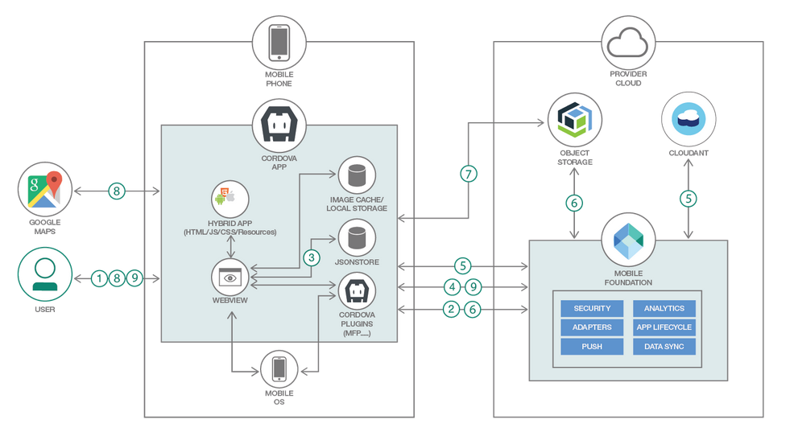
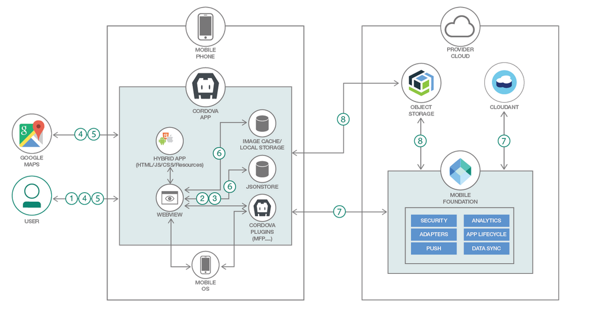

# This content is no more maintained and is archived

# Secure Offline Synchronization using IBM Mobile Foundation
The increasing focus on Digital Transformation has led to more and more use cases where organizations want their enterprise apps to be usable even when the device is offline, and later synchronize the data with the enterprise when the device comes online again.

In this IBM code pattern, we will show you how to securely implement the mobile offline synchronization use case using IBM Mobile Foundation and other IBM technologies.

When you have completed this code pattern, you will understand:
* How to achieve offline user authentication in mobile apps using JSONStore.
* How to store data securely on the device using encrypted JSONStore.
* How to achieve downstream and upstream synchronization of data between CouchDB/Cloudant database and the device using JSONStore's automated data synchronization feature.
* How to achieve downstream and upstream synchronization of images between Cloud Object Storage and the device using [imgCache.js](https://github.com/chrisben/imgcache.js/) and [Cordova File API](https://cordova.apache.org/docs/en/latest/reference/cordova-plugin-file/).

## Flow

### Online scenario



1. When there is network connectivity, user launches and logs in to the mobile app.
2. The mobile app sends the user credentials to Mobile Foundation server for validation. Mobile Foundation server validates the user credentials and returns an appropriate response to the mobile app.
3. If user authentication succeeds, mobile app initializes JSONStore collection with the current user credentials
4. The mobile app initiates data synchronization with the Cloudant database by way of the Mobile foundation adapter.
5. The Mobile Foundation sync adapter makes REST calls to the Cloudant database and returns synchronization data to the mobile app. The data that is fetched from the Cloudant database will have references to the images, which are stored on Cloud Object Storage.
6. Mobile app makes a call to Mobile Foundation adapter, which makes a call to Cloud Object Storage, to get the authorization token. This token will be used by the Mobile app to access the Cloud Object Storage.
7. The mobile app fetches the images using the image-caching plugin.
8. On the mobile app, the synchronized data (from Cloudant) and images (from Cloud Object Storage) are downloaded and available for the user to interact with. User can view the detail page consisting of image and geo-location marked inside Google Maps.
9. After the user views and updates the data in the mobile app, the mobile app stores the new data in the JSONStore collection, which automatically synchronizes the data to the Cloudant database and the images to the Cloud Object Storage by way of the Mobile Foundation adapter.

Other users who click on refresh button on the home page (and those who log in anew) are shown the updated list of problem reports.

### Offline scenario



1. When the device is offline, the user launches and logs in to the mobile app.
2. If the correct password is entered, the mobile app initializes the JSONStore collection with the credentials.
3. If user authentication succeeds (that is, JSONStore initializes successfully), the mobile app reads data from the previously synchronized JSONStore collection and shows the list of items on the Home page.
4. The user can view the detail pages for the items in the list. If the detail page was previously viewed when the device was online, the image has been cached and is viewable offline. The Cordova plugin for Google Maps ensures that the map view works in offline mode.
5. The user can report new civic problems, and capture images and geo location information.
6. The mobile app stores the new data in the JSONStore collection and the image and its thumbnail on local file storage on the mobile device.
7. At at later time, when the device comes online, the mobile app automatically initiates the synchronization of JSONStore collection with the Cloudant database by making a call to MFP sync adapter, which posts the new data to the Cloudant database.
8. The mobile app fetches the authorization token for interacting with the Cloud Object Storage service by making a call to MFP adapter, and then uploads the new images to Cloud Object Storage.

Other users who click on refresh button on the home page (and those who log in anew) can see the newly reported civic problem and its details.


# Watch the Video

[](https://youtu.be/ziQkZQgtEMM)

# Steps
* [1. Setup Ionic and MFP CLI](https://github.com/IBM/Ionic-MFP-App#step-1-setup-ionic-and-mfp-cli)
* [2. Create Cloudant database and populate it with sample data](https://github.com/IBM/Ionic-MFP-App#step-2-create-cloudant-database-and-populate-it-with-sample-data)
* [3. Create IBM Cloud Object Storage service and populate it with sample data](https://github.com/IBM/Ionic-MFP-App#step-3-create-ibm-cloud-object-storage-service-and-populate-it-with-sample-data)
* [4. Create Mobile Foundation service and configure MFP CLI](https://github.com/IBM/Ionic-MFP-App#step-4-create-mobile-foundation-service-and-configure-mfp-cli)
* [5. Download source repo and customize](#step-5-download-source-repo-and-customize)
  - [5.1 Clone repo](#51-clone-repo)
  - [5.2 Update App ID, Name and Description](#52-update-app-id-name-and-description)
  - [5.3 Specify Cloudant credentials in MFP adapter](#53-specify-cloudant-credentials-in-mfp-adapter)
  - [5.4 Specify Cloud Object Storage credentials in MFP Adapter](#54-specify-cloud-object-storage-credentials-in-mfp-adapter)
* [6. Deploy the MFP Adapters and Test them](#step-6-deploy-the-mfp-adapters-and-test-them)
  - [6.1 Build and Deploy the MFP adapters](#61-build-and-deploy-the-mfp-adapters)
  - [6.2 Launch MFP dashboard and verify adapter configurations](#62-launch-mfp-dashboard-and-verify-adapter-configurations)
  - [6.3 Test the JSONStoreCloudantSync adapter](#63-test-the-jsonstorecloudantsync-adapter)
* [7. Run application on Android phone](https://github.com/IBM/Ionic-MFP-App#step-7-run-application-on-android-phone)
* [8. Test the app functionality in offline mode](#step-8-test-the-app-functionality-in-offline-mode)
  - [8.1 Test app in online mode](#81-test-app-in-online-mode)
  - [8.2 Test app in offline mode](#82-test-app-in-offline-mode)

## Prerequisite steps
This project builds on top of https://github.com/IBM/Ionic-MFP-App. Run following steps from that [base project](https://github.com/IBM/Ionic-MFP-App) to provision the needed mobile backend services from IBM Cloud and populate them with sample data, as well as to setup Ionic and MFP CLI on your development machine.
 - [Step 1. Setup Ionic and MFP CLI](https://github.com/IBM/Ionic-MFP-App#step-1-setup-ionic-and-mfp-cli)
 - [Step 2. Create Cloudant database and populate it with sample data](https://github.com/IBM/Ionic-MFP-App#step-2-create-cloudant-database-and-populate-it-with-sample-data)
 - [Step 3. Create IBM Cloud Object Storage service and populate it with sample data](https://github.com/IBM/Ionic-MFP-App#step-3-create-ibm-cloud-object-storage-service-and-populate-it-with-sample-data)
 - [Step 4. Create Mobile Foundation service and configure MFP CLI](https://github.com/IBM/Ionic-MFP-App#step-4-create-mobile-foundation-service-and-configure-mfp-cli)

## Step 5. Download source repo and customize

### 5.1 Clone repo

```
$ git clone https://github.com/IBM/MFP-JSONStore-OfflineSync
$ cd MFP-JSONStore-OfflineSync
```

### 5.2 Update App ID, Name and Description

Update `IonicMobileApp/config.xml` as below. Change `id`, `name`, `description` and `author` details appropriately.

<pre><code>
&lt;?xml version='1.0' encoding='utf-8'?&gt;
&lt;widget <b>id="org.mycity.myward"</b> version="2.0.0" xmlns="https://www.w3.org/ns/widgets" xmlns:cdv="http://cordova.apache.org/ns/1.0" xmlns:mfp="http://www.ibm.com/mobilefirst/cordova-plugin-mfp"&gt;
    <b>&lt;name&gt;MyWard&lt;/name&gt;
    &lt;description&gt;Get your civic issues resolved by posting through this app.&lt;/description&gt;
    &lt;author email="shivahr@gmail.com" href="https://developer.ibm.com/code/author/shivahr/"&gt;Shiva Kumar H R&lt;/author&gt;</b>
...
</code></pre>

### 5.3 Specify Cloudant credentials in MFP adapter

Open `MobileFoundationAdapters/JSONStoreCloudantSync/src/main/adapter-resources/adapter.xml` and update the following properties to point to the Cloudant database created in [Step 2](https://github.com/IBM/Ionic-MFP-App#step-2-create-cloudant-database-and-populate-it-with-sample-data).
 * Update `username` and `password` with the Cloudant API key as generated in [Step 2.2](https://github.com/IBM/Ionic-MFP-App#22-generate-cloudant-api-key).
 * For property `host`, specify the Cloudant Dashboard URL portion after (and excluding) *https://* and upto (and including) *-bluemix.cloudant.com* as shown in the snapshot of [Step 2.2](https://github.com/IBM/Ionic-MFP-App#22-generate-cloudant-api-key).
 * For property `protocol`, leave the default value of `https` as-is.
 * For property `port`, leave the default value of `443` as-is.
 * For property `dbname`, leave the default value of `myward` as-is.
 * For property `createnewdbifnotexist`, leave the default value of `false` as-is.

<pre><code>
&lt;mfp:adapter name="JSONStoreCloudantSync" ...&gt;
  <b>&lt;property name="username" displayName="Cloudant Username" defaultValue=""/&gt;
  &lt;property name="password" displayName="Cloudant Password" defaultValue=""/&gt;
  &lt;property name="host" displayName="Cloudant Host" defaultValue=""/&gt;</b>
  &lt;property name="protocol" displayName="DB protocol" defaultValue="https" /&gt;
  &lt;property name="port" displayName="Db port" defaultValue="443" /&gt;
  &lt;property name="dbname" displayName="Cloudant Database Name" defaultValue="myward"/&gt;
  &lt;property name="createnewdbifnotexist" displayName="Create database if it does not exist?" defaultValue="false" /&gt;
  ...
&lt;/mfp:adapter&gt;
</code></pre>

### 5.4 Specify Cloud Object Storage credentials in MFP Adapter

Open `MobileFoundationAdapters/MyWardData/src/main/adapter-resources/adapter.xml` and update the following properties to point to the Cloud Object Storage created in [Step 3](https://github.com/IBM/Ionic-MFP-App#step-3-create-ibm-cloud-object-storage-service-and-populate-it-with-sample-data).
  * Specify value for `bucketName` as created in [Step 3.1](https://github.com/IBM/Ionic-MFP-App#31-create-ibm-cloud-object-storage).
  * Specify `serviceId` and `apiKey` created in [Step 3.2](https://github.com/IBM/Ionic-MFP-App#32-create-service-id-and-api-key-for-accessing-objects).
  * While creating the bucket in [Step 3.1](https://github.com/IBM/Ionic-MFP-App#31-create-ibm-cloud-object-storage), if you selected a different Location/Resiliency, then update the `endpointURL` as per the specification in https://cloud.ibm.com/docs/services/cloud-object-storage/basics/endpoints.html#select-regions-and-endpoints.

<pre><code>
&lt;mfp:adapter name="MyWardData" ...&gt;
  ...
  <b>&lt;property name="endpointURL" displayName="Cloud Object Storage Endpoint Public URL" defaultValue="https://s3-api.us-geo.objectstorage.softlayer.net"/&gt;
  &lt;property name="bucketName" displayName="Cloud Object Storage Bucket Name" defaultValue=""/&gt;
  &lt;property name="serviceId" displayName="Cloud Object Storage Service ID" defaultValue=""  /&gt;
  &lt;property name="apiKey" displayName="Cloud Object Storage API Key" defaultValue=""/&gt;</b>
&lt;/mfp:adapter&gt;
</code></pre>

## Step 6. Deploy the MFP Adapters and Test them

### 6.1 Build and Deploy the MFP adapters

Build and deploy `UserLogin` Adapter as below.

```
$ cd MobileFoundationAdapters/

$ cd UserLogin
$ mfpdev adapter build
$ mfpdev adapter deploy
```

  Note: In [Step 4](https://github.com/IBM/Ionic-MFP-App#step-4-create-mobile-foundation-service-and-configure-mfp-cli), if you specified `No` to `Make this server the default?`, then you need to specify the name of your server profile (`Cloud-MFP` in our case) at the end of `mfpdev adapter deploy` command as shown below.
```
$ mfpdev adapter deploy Cloud-MFP
```

Build and deploy `MyWardData` adapter as below.

```
$ cd ../MyWardData/
$ mfpdev adapter build
$ mfpdev adapter deploy
```

Build and deploy `JSONStoreCloudantSync` adapter as below.

```
$ cd ../JSONStoreCloudantSync/
$ mfpdev adapter build
$ mfpdev adapter deploy
```

### 6.2 Launch MFP dashboard and verify adapter configurations

Launch MFP Dashboard as below:
  * In the [IBM Cloud dashboard](https://cloud.ibm.com/dashboard/), under `Cloud Foundry Services`, click on the `Mobile Foundation` service you created in [Step 4](https://github.com/IBM/Ionic-MFP-App#step-4-create-mobile-foundation-service-and-configure-mfp-cli). The service overview page that gets shown, will have the MFP dashboard embedded within it. You can also open the MFP dashboard in a separate browser tab by appending `/mfpconsole` to the *url* mentioned in [Step 4](https://github.com/IBM/Ionic-MFP-App#step-4-create-mobile-foundation-service-and-configure-mfp-cli).
  * Inside the MFP dashboard, in the list on the left, you will see the `JSONStoreCloudantSync`, `UserLogin` and `MyWardData` adapters listed.

Verify MFP Adapter configuration as below:
  * Inside the MFP dashboard, click on the `JSONStoreCloudantSync` adapter. Under `Configurations` tab, you should see the various properties we specified in [Step 5.3](#53-specify-cloudant-credentials-in-mfp-adapter) for accessing Cloudant database as shown below. As an alternative to specifying those property values in `MobileFoundationAdapters/JSONStoreCloudantSync/src/main/adapter-resources/adapter.xml` as previously shown in [Step 5.3](#53-specify-cloudant-credentials-in-mfp-adapter), you can deploy the adapters with empty `defaultValue`, and once the adapter is deployed, change the values on this page.

  

  * Click on `Resources` tab. You should see the various REST APIs exposed by `JSONStoreCloudantSync` adapter as shown below. The `Security` column should show the protecting scope `UserLogin` against each REST method.

  

### 6.3 Test the JSONStoreCloudantSync adapter

Create temporary credentials to test adapter REST API as below:
  * Inside the MFP dashboard, click on `Runtime Settings`. Click on `Confidential Clients`. Then click on `New`.
  * In the form that pops up, specify values for `ID` and `Secret` as shown in snapshot below. For `Allowed Scope` enter `**` and click on `Add`. Finally click on `Save`.

  

Test adapter REST API as below:
  * Inside the MFP dashboard, click on the `JSONStoreCloudantSync` adapter. Click on `Resources` and then click on `View Swagger Docs`. The Swagger UI for adapter REST APIs will get shown in a new window/tab.
  * Inside the Swagger UI, click on `Expand Operations`.
  * To test the `POST /modifications` API, first click on `OFF` toggle button to enable authentication. Select `UserLogin` and click on `Authorize` as shown below. Enter the `ID` and `Secret` created above against `Username` and `Password`. Click `OK`. If authentication is successful, the toggle button will switch to `ON` position.

  

  * Specify value for parametrer `db_name` as `myward`, for parameter `seqid` as `0`, and following JSON object under POST body:
```
{
  "_id": "string",
  "_rev": "string",
  "json": "[]"
}
```

  * Finally click on `Try it out` button to run the `POST /modifications` API. The API response should get shown in the `Response Body` as shown in snapshot below.

  

Delete the temporary credentials after testing adapter REST API as below:
  * Inside the MFP dashboard, click on `Runtime Settings`. Click on `Confidential Clients`.
  * Delete the `Client ID` created previously.


## Step 7. Run application on Android phone

Follow the instructions in [Step 7](https://github.com/IBM/Ionic-MFP-App#step-7-run-application-on-android-phone) of base project to run the application on Android phone.

## Step 8. Test the app functionality in offline mode

### How the app works in offline mode
A note on how the offline mode is supported for each of the pages<sup>\*</sup> in MyWard app: (<sup>\*</sup>Ionic page is the equivalent of [iOS View](https://developer.apple.com/library/archive/documentation/WindowsViews/Conceptual/ViewPG_iPhoneOS/CreatingViews/CreatingViews.html) or [Android Activity](https://developer.android.com/guide/components/activities/))

* `Login` page:
  - The first time the app is launched after installation, the user login will work only in online mode. This is to make sure that the user credentials are validated by making a call to MFP security adapter. Once the user authentication succeeds, subsequent login attempts by the same user are supported in offline mode with the help of encrypted [JSONStore](https://mobilefirstplatform.ibmcloud.com/tutorials/en/foundation/7.1/advanced-topics/offline-authentication/).

* `Home` page: (downstream sync)
  - [JSONStore](https://mobilefirstplatform.ibmcloud.com/tutorials/en/foundation/8.0/application-development/jsonstore/) for storing/syncing data with Cloudant.
  - [imgcache.js](https://github.com/chrisben/imgcache.js/) for caching the image thumbnails loaded from Cloud Object Storage.

* `Problem Detail` page: (downstream sync)

  Grievances for which the details are already seen in online mode:
  - JSONStore for storing/syncing data with Cloudant.
  - imgcache.js for caching the image loaded from Cloud Object Storage.
  - [Cordova plugin for Google Maps](https://github.com/mapsplugin/cordova-plugin-googlemaps#what-is-the-difference-between-this-plugin-and-google-maps-javascript-api-v3) to make sure that the map view works even in offline mode.

* `Report New Problem` page: (upstream sync)
  - Data to be uploaded to Cloudant is stored in JSONStore which later syncs it with Cloudant when device comes online.
  - Image and its thumbnail are stored on local storage, and are later uploaded to Cloud Object Storage when devices comes online.

Note: In the current implementation, images and its thumbnails are stored as-is on the local file storage at [cordova.file.dataDirectory](https://cordova.apache.org/docs/en/latest/reference/cordova-plugin-file/#where-to-store-files) which is private to the application. If you have a more stringent compliance requirement of having to encrypt the images stored locally on the phone, then follow the recommendations on [this](https://mobilefirstplatform.ibmcloud.com/tutorials/en/foundation/8.0/application-development/jsonstore/#security-utilities) page.

### 8.1 Test app in online mode
* Build and run the application on your phone as per instructions in [Step 7.6](https://github.com/IBM/Ionic-MFP-App/blob/master/README.md#76-buildrun-the-ionic-application-on-android-phone).
* Login with username say `Test` and password `Test`. (Note: We have used a simple MFP security adapter that returns success when password equals username.)
* Make sure that the `Home` page displays list of grievances along with image thumbnails.
* Click on a few of the grievances to see their details. On the `Problem Detail` page, make sure that the image and Google Maps location are displayed.
* Back on the `Home` page, click on the `+` icon to report a new grievance. Add description, take photo, grab geolocation and finally submit. Make sure that the new grievance is successfully submitted to server.
* On a different device, whoever launches the app (or clicks on refresh button) should see your newly reported grievance.

### 8.2 Test app in offline mode
* Have the device go offline by turning off `Mobile data` and `Wi-Fi`.
* Launch the `MyWard` app.
* Login using the same username and password as before. Make sure login succeeds even in offline mode.
* Make sure that the `Home` page displays list of grievances along with image thumbnails.
* Click on the grievances for which you had seen the details before. Make sure that the image and Google Maps location are displayed even in offline mode.
* Back on the `Home` page, click on the `+` icon to report a new grievance. Add description, take photo, grab gelocation and finally submit. Make sure that the new grievance report is successfully accepted even in offline mode.
* Back on the `Home` page, the newly reported problem should get listed at the end along with its thumbnail. Upon clicking it, the `Problem Detail` page should show image.
* Get the device online by turning on either `Mobile data` or `Wi-Fi`.
* In a while the newly reported grievance would get uploaded to server and page would get refreshed to show new list of grievances as seen on server. Make sure that the grievance that you just reported is listed as well.
* On a different device, whoever launches the app (or clicks on refresh button) should see your newly reported grievance.

# Troubleshooting

Please see instructions for [debugging Android hybrid app using Chrome Developer Tools](https://github.com/IBM/Ionic-MFP-App#debugging-android-hybrid-app-using-chrome-developer-tools) or [troubleshooting guide](https://github.com/IBM/Ionic-MFP-App/blob/master/TROUBLESHOOTING.md) for solutions to some commonly occuring problems.

### Clearing JSONStore data on the phone
In case the JSONStore data on the phone gets messed up during app development/testing, then you can clear it as per the instructions below.

* Install Google Chrome.

* Open Google Chrome. Open URL `chrome://inspect/#devices`

* Under `Devices`, click on `Inspect` below your connected device.

* Click on `Console` view.

* In the command prompt at the end, type following command and press enter. This would delete all the JSONStore collections on the device.

```
WL.JSONStore.destroy();
```

# References

* [JSONStore - Encrypted on device storage & automated data sync for better app performance & offline access](https://mobilefirstplatform.ibmcloud.com/tutorials/en/foundation/8.0/application-development/jsonstore/)
* [Offline authentication using JSONStore](https://mobilefirstplatform.ibmcloud.com/tutorials/en/foundation/7.1/advanced-topics/offline-authentication/)
* [Automated synchronization of JSONStore collections with CouchDB databases](https://mobilefirstplatform.ibmcloud.com/blog/2018/02/23/jsonstoresync-couchdb-databases/)
* [cordova-plugin-file - a File API allowing read/write access to files residing on the device](https://cordova.apache.org/docs/en/latest/reference/cordova-plugin-file/)

# License
This code pattern is licensed under the Apache Software License, Version 2.  Separate third party code objects invoked within this code pattern are licensed by their respective providers pursuant to their own separate licenses. Contributions are subject to the [Developer Certificate of Origin, Version 1.1 (DCO)](https://developercertificate.org/) and the [Apache Software License, Version 2](https://www.apache.org/licenses/LICENSE-2.0.txt).

[Apache Software License (ASL) FAQ](https://www.apache.org/foundation/license-faq.html#WhatDoesItMEAN)
